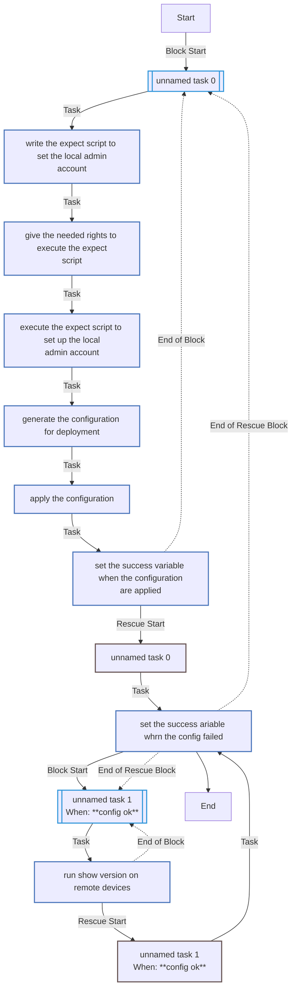
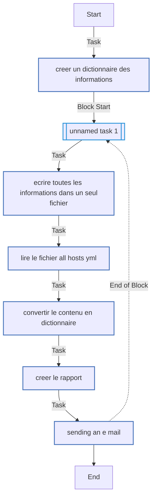
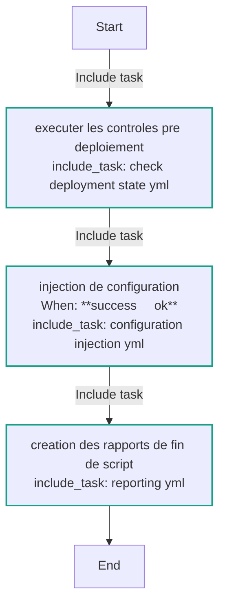
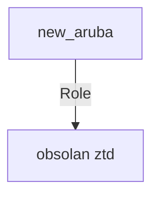

```mermaid
flowchart TD
Start
classDef block stroke:#3498db,stroke-width:2px;
classDef task stroke:#4b76bb,stroke-width:2px;
classDef includeTasks stroke:#16a085,stroke-width:2px;
classDef importTasks stroke:#34495e,stroke-width:2px;
classDef includeRole stroke:#2980b9,stroke-width:2px;
classDef importRole stroke:#699ba7,stroke-width:2px;
classDef includeVars stroke:#8e44ad,stroke-width:2px;
classDef rescue stroke:#665352,stroke-width:2px;

  Start-->|Block Start| Unnamed_task_00_block_start_0[[unnamed task 0]]:::block
  Unnamed_task_00_block_start_0-->|Task| Check_ssh_port0[check ssh port]:::task
  Check_ssh_port0-.->|End of Block| Unnamed_task_00_block_start_0
  Check_ssh_port0-->|Rescue Start| Unnamed_task_00_rescue_start_0[unnamed task 0]:::rescue
  Unnamed_task_00_rescue_start_0-->|Task| Unnamed_task_00[unnamed task 0]:::task
  Unnamed_task_00-.->|End of Rescue Block| Unnamed_task_00_block_start_0
  Unnamed_task_00-->|Block Start| Unnamed_task_11_block_start_0[[unnamed task 1<br>When: **success     ok**]]:::block
  Unnamed_task_11_block_start_0-->|Task| checking_if_all_values_are_there0[checking if all values are there<br>When: **csv serial value       or csv mac value**]:::task
  checking_if_all_values_are_there0-->|Task| create_an_expect_script_to_get_mac_and_serial_values_even_at_first_log1[create an expect script to get mac and serial<br>values even at first log]:::task
  create_an_expect_script_to_get_mac_and_serial_values_even_at_first_log1-->|Task| set_rights_so_the_expect_script_can_be_executed2[set rights so the expect script can be executed]:::task
  set_rights_so_the_expect_script_can_be_executed2-->|Task| MAC_and_SERIAL_value_extract3[mac and serial value extract]:::task
  MAC_and_SERIAL_value_extract3-->|Task| extract_Serial_value4[extract serial value]:::task
  extract_Serial_value4-->|Task| extract_MAC_value5[extract mac value]:::task
  extract_MAC_value5-->|Task| Check_if_the_MAC_values_are_matching6[check if the mac values are matching<br>When: **mac value is not search csv mac value**]:::task
  Check_if_the_MAC_values_are_matching6-->|Task| Check_if_the_SERIAL_values_are_matching7[check if the serial values are matching<br>When: **serial value is not search csv serial value**]:::task
  Check_if_the_SERIAL_values_are_matching7-->|Task| SERIAL_and_MAC_KO8[serial and mac ko<br>When: **serial value is not search csv serial value  and<br>mac value is not search csv mac value**]:::task
  SERIAL_and_MAC_KO8-.->|End of Block| Unnamed_task_11_block_start_0
  SERIAL_and_MAC_KO8-->|Rescue Start| Unnamed_task_11_rescue_start_0[unnamed task 1<br>When: **success     ok**]:::rescue
  Unnamed_task_11_rescue_start_0-->|Task| gestion_des_echecs0[gestion des echecs]:::task
  gestion_des_echecs0-.->|End of Rescue Block| Unnamed_task_11_block_start_0
  gestion_des_echecs0-->|Block Start| Unnamed_task_22_block_start_0[[unnamed task 2<br>When: **success     ok**]]:::block
  Unnamed_task_22_block_start_0-->|Task| checking_if_all_values_are_there0[checking if all values are there<br>When: **csv serial value       or csv mac value**]:::task
  checking_if_all_values_are_there0-->|Task| create_an_expect_script_to_get_mac_and_serial_values1[create an expect script to get mac and serial<br>values]:::task
  create_an_expect_script_to_get_mac_and_serial_values1-->|Task| set_rights_so_the_expect_script_can_be_executed2[set rights so the expect script can be executed]:::task
  set_rights_so_the_expect_script_can_be_executed2-->|Task| MAC_and_SERIAL_value_extract3[mac and serial value extract]:::task
  MAC_and_SERIAL_value_extract3-->|Task| extract_SERIAL_value4[extract serial value]:::task
  extract_SERIAL_value4-->|Task| extract_MAC_value5[extract mac value]:::task
  extract_MAC_value5-->|Task| Check_if_the_MAC_values_are_matching6[check if the mac values are matching<br>When: **mac value is not search csv mac value**]:::task
  Check_if_the_MAC_values_are_matching6-->|Task| Check_if_the_SERIAL_values_are_matching7[check if the serial values are matching<br>When: **serial value is not search csv serial value**]:::task
  Check_if_the_SERIAL_values_are_matching7-->|Task| SERIAL_and_MAC_KO8[serial and mac ko<br>When: **serial value is not search csv serial value  and<br>mac value is not search csv mac value**]:::task
  SERIAL_and_MAC_KO8-.->|End of Block| Unnamed_task_22_block_start_0
  SERIAL_and_MAC_KO8-->|Rescue Start| Unnamed_task_22_rescue_start_0[unnamed task 2<br>When: **success     ok**]:::rescue
  Unnamed_task_22_rescue_start_0-->|Task| gestion_des_echecs0[gestion des echecs]:::task
  gestion_des_echecs0-.->|End of Rescue Block| Unnamed_task_22_block_start_0
  gestion_des_echecs0-->End
```

<!-- DOCSIBLE START -->

# 📃 Role overview

## obsolan_ZTD


Description: your role description


| Field                | Value           |
|--------------------- |-----------------|
| Readme update        | 22/11/2024 |


### Vars

**These are variables with higher priority**
#### File: vars/main.yml

| Var          | Type         | Value       |Required    | Title       |
|--------------|--------------|-------------|-------------|-------------|
| [SUCCESS](vars/main.yml#L3)   | str   | `OK` |    n/a  |  n/a |
| [adm_vlan_value](vars/main.yml#L4)   | int   | `300` |    n/a  |  n/a |
| [adm_vlan_name](vars/main.yml#L5)   | str   | `MSY_ADM` |    n/a  |  n/a |


### Tasks


#### File: tasks/check_deployment_state.yml

| Name | Module | Has Conditions |
| ---- | ------ | --------- |
| Unnamed_block | block | False |
| Check ssh port |  | False |
| Unnamed_block | block | True |
| checking if all values are there | set_fact | True |
| create an expect script to get mac and serial values even at first log | template | False |
| set rights so the expect script can be executed | shell | False |
| MAC and SERIAL value extract | command | False |
| extract Serial value | set_fact | False |
| extract MAC value | set_fact | False |
| Check if the MAC values are matching | set_fact | True |
| Check if the SERIAL values are matching | set_fact | True |
| SERIAL and MAC KO | set_fact | True |
| Unnamed_block | block | True |
| checking if all values are there | set_fact | True |
| create an expect script to get mac and serial values | template | False |
| set rights so the expect script can be executed | shell | False |
| MAC and SERIAL value extract | command | False |
| extract SERIAL value | set_fact | False |
| extract MAC value | set_fact | False |
| Check if the MAC values are matching | set_fact | True |
| Check if the SERIAL values are matching | set_fact | True |
| SERIAL and MAC KO | set_fact | True |

#### File: tasks/configuration_injection.yml

| Name | Module | Has Conditions |
| ---- | ------ | --------- |
| Unnamed_block | block | False |
| write the expect script to set the local admin account | template | False |
| give the needed rights to execute the expect script | shell | False |
| execute the expect script to set up the local admin account | command | False |
| generate the configuration for deployment | template | False |
| Apply the configuration | arubanetworks.aoscx.aoscx_config | False |
| set the SUCCESS variable when the configuration are applied | set_fact | False |
| Unnamed_block | block | True |
| run show version on remote devices | ansible.netcommon.cli_command | False |

#### File: tasks/reporting.yml

| Name | Module | Has Conditions |
| ---- | ------ | --------- |
| Creer un dictionnaire des informations | set_fact | False |
| Unnamed_block | block | False |
| Ecrire toutes les informations dans un seul fichier | copy | False |
| Lire le fichier ALL_hosts.yml | slurp | False |
| Convertir le contenu en dictionnaire | set_fact | False |
| Creer le rapport | template | False |
| Sending an e-mail | community.general.mail | False |

#### File: tasks/main.yml

| Name | Module | Has Conditions |
| ---- | ------ | --------- |
| Executer les controles pre-deploiement | include_tasks | False |
| Injection de configuration | include_tasks | True |
| creation des rapports de fin de script | include_tasks | False |


## Task Flow Graphs


### Graph for check_deployment_state.yml




### Graph for configuration_injection.yml




### Graph for reporting.yml




### Graph for main.yml




## Author Information
your name

#### License

license (GPL-2.0-or-later, MIT, etc)

#### Minimum Ansible Version

2.1

#### Platforms

No platforms specified.
[ft999238a@srv3060 .ansible]$ docsible --role obsolan_ZTD/ obso_ZTD.yml --graph
Usage: docsible [OPTIONS]
Try 'docsible --help' for help.

Error: Got unexpected extra argument (obso_ZTD.yml)
[ft999238a@srv3060 .ansible]$ docsible --role obsolan_ZTD/ --playbook obso_ZTD.yml --graph
Readme file backed up as: /home/ft999238a/.ansible/obsolan_ZTD/README_backup_20241122095018.md
Documentation generated at: /home/ft999238a/.ansible/obsolan_ZTD/README.md
[ft999238a@srv3060 .ansible]$ cat /home/ft999238a/.ansible/obsolan_ZTD/README.md
<!-- DOCSIBLE START -->

# 📃 Role overview

## obsolan_ZTD


Description: your role description


| Field                | Value           |
|--------------------- |-----------------|
| Readme update        | 22/11/2024 |


### Vars

**These are variables with higher priority**
#### File: vars/main.yml

| Var          | Type         | Value       |Required    | Title       |
|--------------|--------------|-------------|-------------|-------------|
| [SUCCESS](vars/main.yml#L3)   | str   | `OK` |    n/a  |  n/a |
| [adm_vlan_value](vars/main.yml#L4)   | int   | `300` |    n/a  |  n/a |
| [adm_vlan_name](vars/main.yml#L5)   | str   | `MSY_ADM` |    n/a  |  n/a |


### Tasks


#### File: tasks/check_deployment_state.yml

| Name | Module | Has Conditions |
| ---- | ------ | --------- |
| Unnamed_block | block | False |
| Check ssh port |  | False |
| Unnamed_block | block | True |
| checking if all values are there | set_fact | True |
| create an expect script to get mac and serial values even at first log | template | False |
| set rights so the expect script can be executed | shell | False |
| MAC and SERIAL value extract | command | False |
| extract Serial value | set_fact | False |
| extract MAC value | set_fact | False |
| Check if the MAC values are matching | set_fact | True |
| Check if the SERIAL values are matching | set_fact | True |
| SERIAL and MAC KO | set_fact | True |
| Unnamed_block | block | True |
| checking if all values are there | set_fact | True |
| create an expect script to get mac and serial values | template | False |
| set rights so the expect script can be executed | shell | False |
| MAC and SERIAL value extract | command | False |
| extract SERIAL value | set_fact | False |
| extract MAC value | set_fact | False |
| Check if the MAC values are matching | set_fact | True |
| Check if the SERIAL values are matching | set_fact | True |
| SERIAL and MAC KO | set_fact | True |

#### File: tasks/configuration_injection.yml

| Name | Module | Has Conditions |
| ---- | ------ | --------- |
| Unnamed_block | block | False |
| write the expect script to set the local admin account | template | False |
| give the needed rights to execute the expect script | shell | False |
| execute the expect script to set up the local admin account | command | False |
| generate the configuration for deployment | template | False |
| Apply the configuration | arubanetworks.aoscx.aoscx_config | False |
| set the SUCCESS variable when the configuration are applied | set_fact | False |
| Unnamed_block | block | True |
| run show version on remote devices | ansible.netcommon.cli_command | False |

#### File: tasks/reporting.yml

| Name | Module | Has Conditions |
| ---- | ------ | --------- |
| Creer un dictionnaire des informations | set_fact | False |
| Unnamed_block | block | False |
| Ecrire toutes les informations dans un seul fichier | copy | False |
| Lire le fichier ALL_hosts.yml | slurp | False |
| Convertir le contenu en dictionnaire | set_fact | False |
| Creer le rapport | template | False |
| Sending an e-mail | community.general.mail | False |

#### File: tasks/main.yml

| Name | Module | Has Conditions |
| ---- | ------ | --------- |
| Executer les controles pre-deploiement | include_tasks | False |
| Injection de configuration | include_tasks | True |
| creation des rapports de fin de script | include_tasks | False |


## Task Flow Graphs


### Graph for check_deployment_state.yml


### Graph for configuration_injection.yml


### Graph for reporting.yml


### Graph for main.yml


## Playbook

```yml
---
- name: Playbook for zero touch deployment for the OBSOLAN project
  hosts: new_aruba
  gather_facts: no
  vars:
    working_dir: tmp/obsolan_ZTD
    current_date: "{{ lookup('pipe', 'date +\"%Y_%m_%d\"') }}"
  pre_tasks:
    - block:
      - name: Generer l'inventaire Ansible à partir du CSV
        command: python3 obsolan_ZTD/files/inv_generator.py
        delegate_to: localhost
        run_once: true

      - name: Générer le dossier de travail
        ansible.builtin.file:
          state: directory
          path: "{{working_dir}}"
          mode: '0755'

      - meta: refresh_inventory

  roles:
    - obsolan_ZTD

```
## Playbook graph


## Author Information
your name

#### License

license (GPL-2.0-or-later, MIT, etc)

#### Minimum Ansible Version

2.1

#### Platforms

No platforms specified.
<!-- DOCSIBLE END -->[
