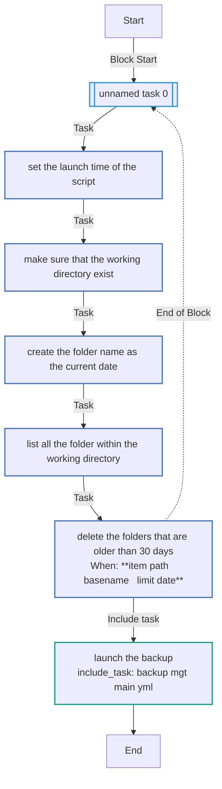
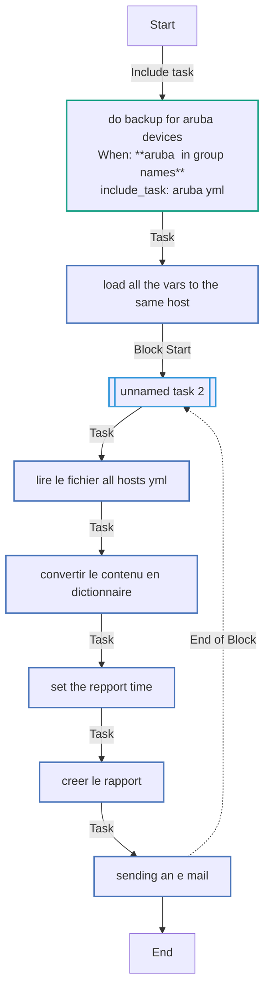
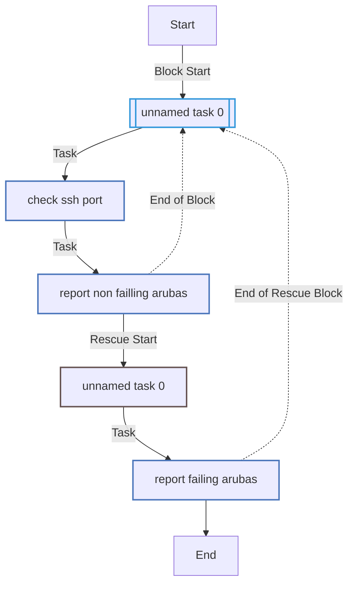
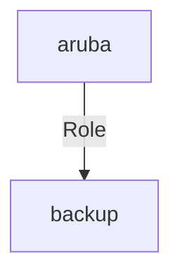

<!-- DOCSIBLE START -->

# 📃 Role overview

## backup


Description: your role description


| Field                | Value           |
|--------------------- |-----------------|
| Readme update        | 25/11/2024 |


### Tasks


#### File: tasks/main.yml

| Name | Module | Has Conditions |
| ---- | ------ | --------- |
| Unnamed_block | block | False |
| set the launch time of the script | set_fact | False |
| Make sure that the working directory exist | ansible.builtin.file | False |
| create the folder name as the current date | ansible.builtin.file | False |
| List all the folder within the working directory | ansible.builtin.find | False |
| Delete the folders that are older than 30 days | ansible.builtin.file | True |
| launch the backup | include_tasks | False |

#### File: tasks/backup_mgt/main.yml

| Name | Module | Has Conditions |
| ---- | ------ | --------- |
| do backup for aruba devices | include_tasks | True |
| load all the vars to the same host | set_fact | False |
| Unnamed_block | block | False |
| Lire le fichier ALL_hosts.yml | slurp | False |
| Convertir le contenu en dictionnaire | set_fact | False |
| set the repport time | set_fact | False |
| Creer le rapport | template | False |
| Sending an e-mail | community.general.mail | False |

#### File: tasks/backup_mgt/aruba.yml

| Name | Module | Has Conditions |
| ---- | ------ | --------- |
| Unnamed_block | block | False |
| Check ssh port |  | False |
| Report non failling arubas | set_fact | False |


## Task Flow Graphs


### Graph for main.yml




### Graph for backup_mgt/main.yml




### Graph for backup_mgt/aruba.yml




## Playbook

```yml
---
- name: Playbook for network and cybersecurity running-configuration backup
  hosts: aruba
  gather_facts: no
  vars:
    working_dir: tmp/backup
    current_date: "{{ lookup('pipe', 'date +\"%Y_%m_%d\"') }}"
    limit_date: "{{ lookup('pipe', 'date --date=\"30 days ago\" +%Y_%m_%d') }}"
  roles:
    - backup

```
## Playbook graph


## Author Information
your name

#### License

license (GPL-2.0-or-later, MIT, etc)

#### Minimum Ansible Version

2.1

#### Platforms

No platforms specified.
<!-- DOCSIBLE END -->[
